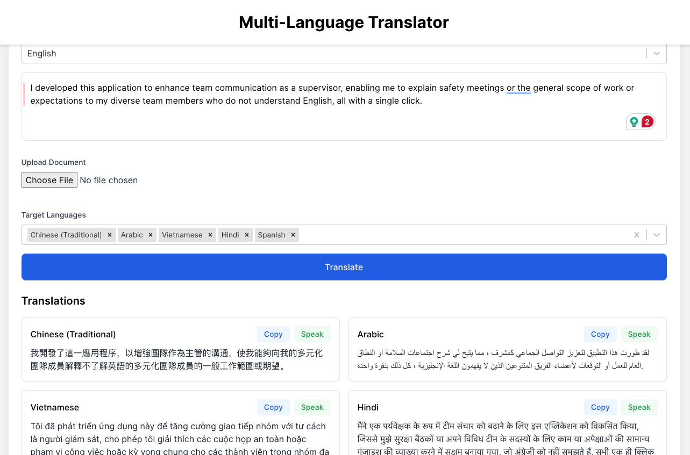

# [Multiple Language Translator](https://multi-language-translator-lyart.vercel.app/)

**Multi-Language Translator** is a user-friendly web app that enables translation into multiple languages, supporting up to 108 languages, to facilitate communication with just a single click.

## Features
- **Instant Translation:** Translate text in real-time between multiple languages.
- **Multiple Targets:** Choose one or more languages to translate your text into.
- **Copy & Speak:** Easily copy translated text or listen to it using text-to-speech.
- **History:** Keep track of your past translations for quick reference.
- **Group Meetings:** Bridge language gaps when meeting people who might not speak the common language.

## Get Started
Visit [Multiple Language Translator](https://multi-language-translator-lyart.vercel.app/) and start translating today!
